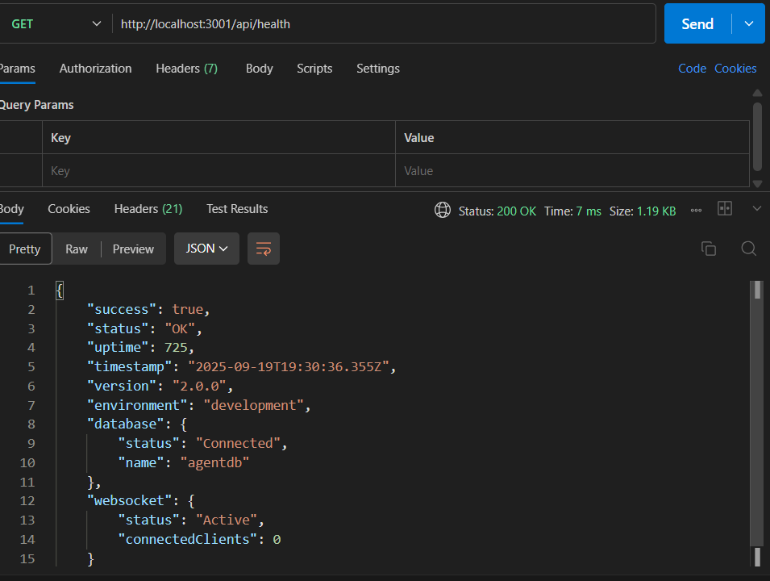
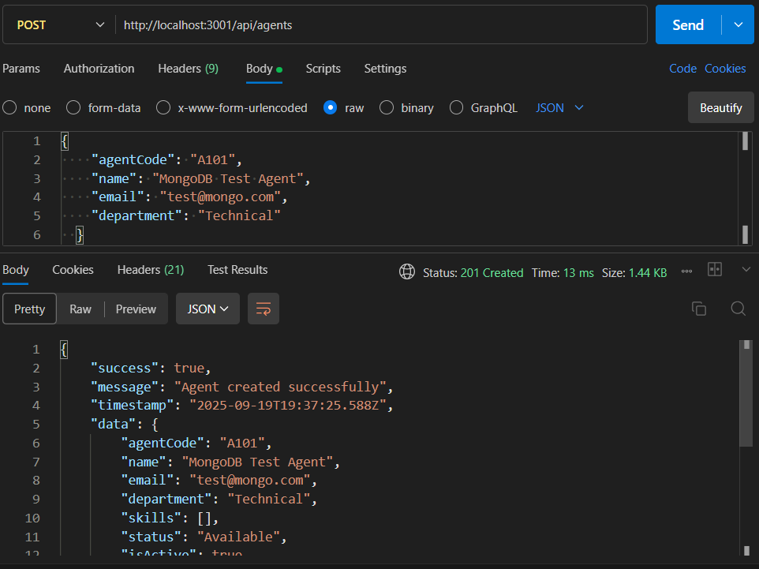
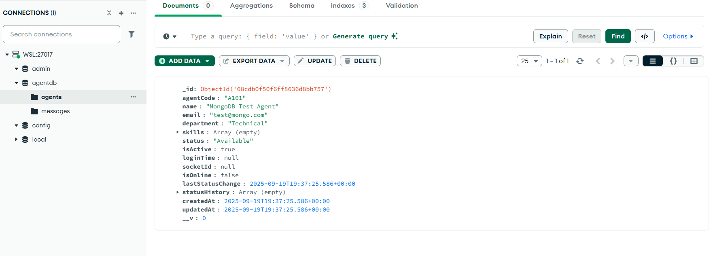
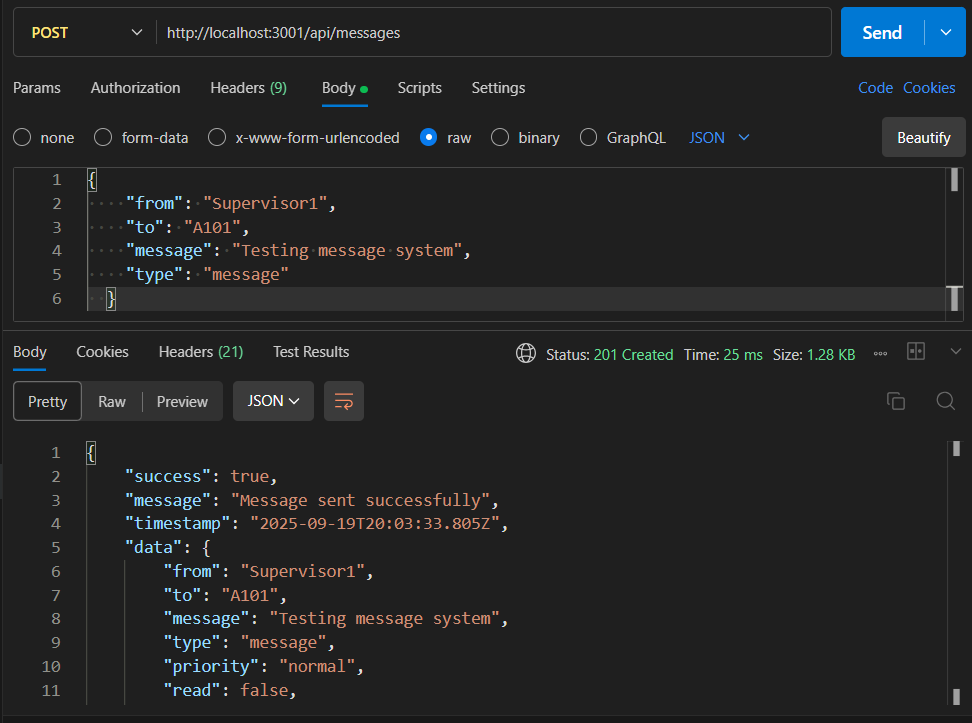
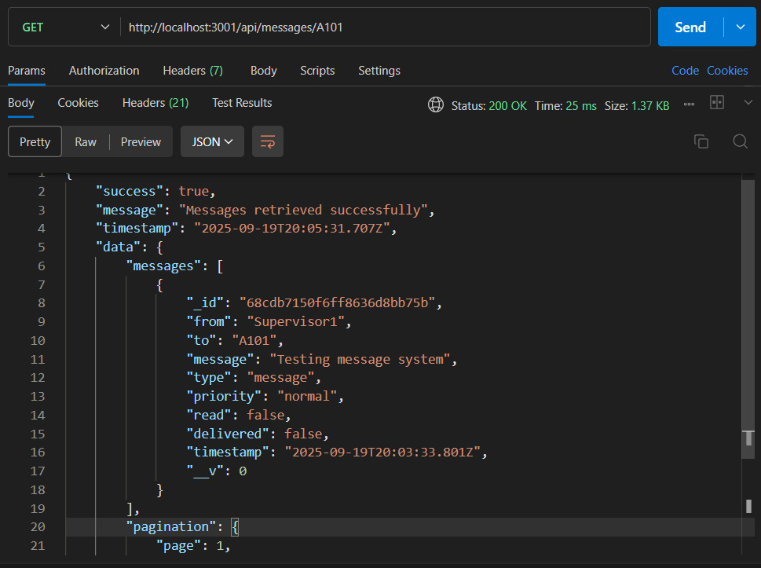
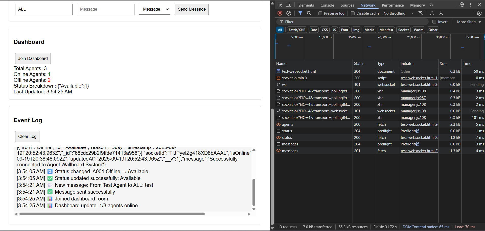

# Phase 2

## API Endpoints Test
- GET http://localhost:3001/api/health

## CRUD Operations Test (MongoDB)
- POST http://localhost:3001/api/agents

- GET http://localhost:3001/api/agents

- mongodb 

## Message System Test
- POST http://localhost:3001/api/messages

- GET http://localhost:3001/api/messages/A101

## WebSocket Test
1. Click "Connect" 
2. Enter agent code "A101"
3. Click "Login as Agent"
4. Try "Update Status"
5. Try "Send Message"
6. Click "Join Dashboard"
